# Who uses TiBillet?

Different people use each engine for different purposes. Let's take a look.

```mermaid
graph LR
    
    a <--> c & e & o
    c <--> b & h
    h & e <--> u
    o <--> e

    h[Card Holders 💻📱]

    subgraph LaBoutik
        a[Accountants 💻];  b[Buyers 🖥️]; c[Cashiers 🖥️]
    end

    subgraph Lespass
        u[Ushers 📱];  e[Event Planners 💻]
    end

    subgraph Fedow
        o[Coordinators 💻]
    end
```

!!! note "First draft"
    This is a first attempt at defining the user roles that TiBillet has to account for. Feel free to correct or add to them, this work document will be better for it!

## Cashiers

Engines
: LaBoutik

Devices
: :fontawesome-solid-cash-register: Register

- hold the LaBoutik register
- have an understanding of sales, stocks and the LaBoutik register app
- interact with [Buyers](#buyers), [Card Holders](#card-holders) and [Accountants](#accountants)

---

## Accountants

Engines
: LaBoutik

Devices
: :fontawesome-solid-laptop: Laptop

- survey cash and cashless flow, create documents
- have an understanding of money regulations, budget and LaBoutik transaction history
- interact with [Cashiers](#cashiers), [Event Planners](#event-planners) and [Coordinators](#coordinators)

---

## Buyers

Engines
: LaBoutik

Devices
: :fontawesome-solid-cash-register: Register

- buy cash articles
- hear about cashless cards and benefits for volunteers
- interact with [Cashiers](#cashiers)

---

## Card Holders

Engines
: LaBoutik, Lespass

Devices
: :fontawesome-solid-laptop: :material-cellphone: Laptop and smartphone

- suscribers, collective members or cashless buyers
- have an understanding of their cashless wallet, Lespass navigation and events
- interact with [Cashiers](#cashiers) and [Ushers](#ushers)

---

## Ushers

Engines
: Lespass

Devices
: :material-cellphone: Smartphone

- open and check in for events
- understand Card Holder profiles, Lespass events and bookings
- interact with [Card Holders](#card-holders) and [Event Planners](#event-planners)

---

## Event Planners

Engines
: Lespass

Devices
: :fontawesome-solid-laptop: Laptop

- organize events plan for use of a specific Lespass space
- have an understanding or planning, cultural networks, the Lespass calendar and ticket pricing
- interact with [Accountants](#accountants), [Ushers](#ushers) and [Coordinators](#coordinators)

---

## Coordinators

Engines
: Fedow

Devices
: :fontawesome-solid-laptop: Laptop

- consult with spaces, federations and the general population to reach consensus on what is federated where and how
- have an understanding of horizontal organizing, mediation, local economics and the Fedow administration
- interact with [Accountants](#accountants), [Event Planners](#event-planners) and anyone with a opinion

