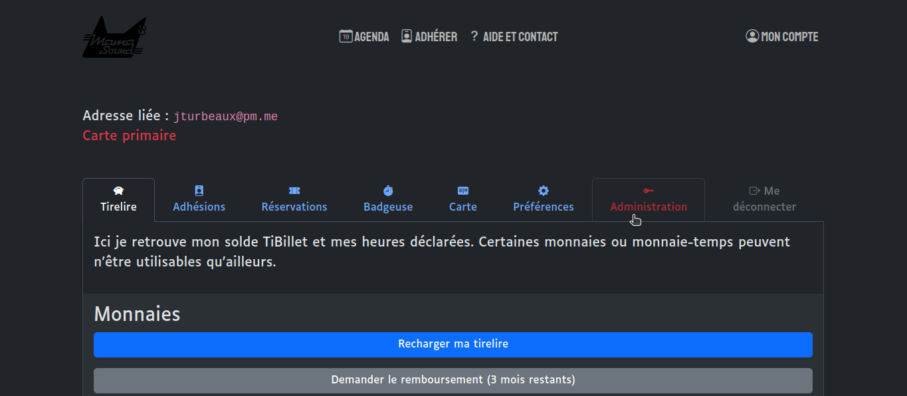

Dans un premier temps il faudra vous connecter sur la page d'administration de votre instance de billetterie en passant par votre compte.

## Ajouter un nouvel événement

### 1- Onglet Général

- Cliquez sur la catégorie "Evenements" dans la colonne de gauche sous l'onglet Evenementiel.
- Cliquez sur le bouton "AJOUTER EVENEMENT +" en haut à droite
- Remplissez le formulaire :
  - Renseignez le nom de l'évènement
  - Sélectionnez la catégorie d'événement
  - Renseignez la date et l'heure de début 
  - Renseignez la date et l'heure de fin (optionnel)
  - Importez l'image 
    **L'image sert de miniature sur la page agenda**
  - Importez une ou plusieurs images pour le caroussel
    **L'image sert d'entête dans la page de description de l'événement**
  - Inscrivez une description courte (phrase d'accroche présente en dessous du titre)
  - Inscrivez une description longue (permet de donner plus d'informations dans votre page événement dans la section "programme").
  - Entrée une "Jauge Maximal" (permet de jauger le nombre de personne pour un evenement avec réservation). Si votre évènement ne prend pas en compte les réservations, inscrivez 0.
  - Renseignez l'adresse postale de votre lieu (cf. Adresse).
  - Cliquez sur le bouton "publier" (permet d'afficher ou non votre événement dans l'agenda).

#### 2- Produits (Réservations)

Cette section permet d'afficher des produits sur la page de réservation de l'événement
Ces produits peuvent être des tarifs, des adhésions, des abonnements, des recharges cashless, du marchandising ou autre...

- Renseignez le nombre de reservation maximales par utilisateur·ices.
- Cliquez sur le "+" pour ajouter un produit ou sélectionnez un produit (il s'agit du prix de votre réservation et les infos associés).
  - "Type de produit" permet de trier les produits par catégories pour leur attribuer un prix par la suite
  - "Poids" permet de choisir l'ordre d'affichage des produits sur la page de réservation (le plus petit sera le premier)
  - CLiquez sur le bouton enregistrer en bas de cette nouvelle fenètre pour valider
Vos produits doivent désormais apparaitrent dans la liste de la section "Articles"
  - Sélectionnez ceux que vous souhaitez afficher sur votre page de réservation en maintenant la touche ctrl et cliquant dessus. Ils seront surlignés en bleu.
    *vous pouvez déselectionner de la même façon : ctrl et clique droit

#### 3- Tags et formulaires

- Ajoutez des tags en lien avec votre événement, ils vous permet de les filtrer et les catégoriser.
- Les "options" peuvent être sélectionnées ou créés de la même façon que les "produits" en cliquant sur le "+".
  - "choix unique" oblige la personne qui réserve à sélectionner une (et une seule) option parmi celles proposées
  - "choix multiple" permet au public d'ajouter ou non cette option de manière libre

## 4- Onglet Actions

lorsque vous retournez en haut de la page, à droite de l'onglet "géréral", cliquez sur l'onglet "action".
- Cliquez sur le bouton "Ajouter un objet action supplémentaire"
  - Renseignez le nom de l'évènement
  - Date de début et de fin
  - Puis renseignez un nombre pour la jauge de spectateur
Ces actions permettent de créer plusieurs espaces de spectacles dans un même lieu avec un nombre de personne limité.

## 5- Publier votre événement

 - Cliquez sur le bouton enregistrer pour valider l'ajout de votre nouvel événement

:::danger
Attention ! Après la création de produits (étape 2) il faut penser à lui attribuer un tarif.
Pour ce faire :
- Cliquez sur la catégorie "Produits" dans la colonne de gauche sous l'onglet Produits.
- Sélectionnez le produit précédemment créé.
- Cliquez sur l'onglet Tarifs
- Remplissez le reste du formulaire (descriptions, prix, stock...)
    *c'est à ce moment que vous pouvez choisir de conditionner la réservation de billet à une adhésion.
    *rappel : les adhésions sont à créer dans la section "Produits".
- Cliquez sur le bouton "enregistrer" en bas de page
:::

<video width="100%" controls src="/img/addevent.mp4"></video>
